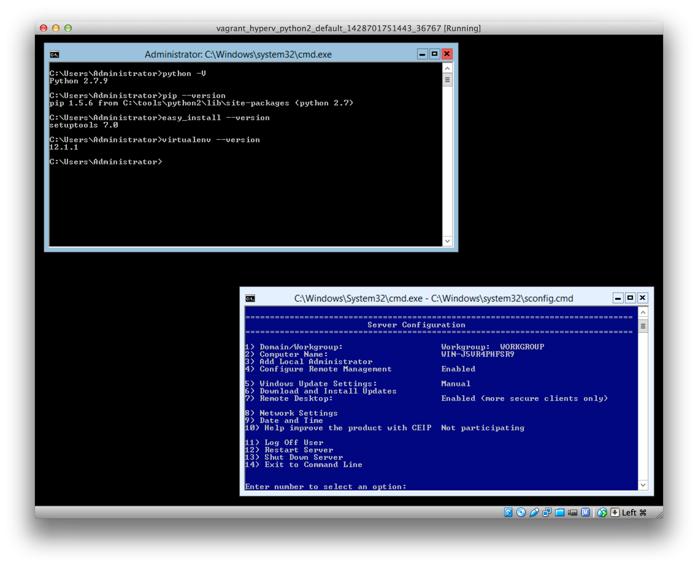

# A lightweight [Vagrant][] VM with [Microsoft Hyper-V Server 2012 R2][Hyper-V Server] and Python 2

https://vagrantcloud.com/msabramo/boxes/HyperVServer2012R2PlusPython2

Note: If you need a VM with SQL Server Express, you may want to checkout
https://github.com/msabramo/vagrant_sql_server_express instead.

# What is Hyper-V Server 2012?

From
http://www.microsoft.com/en-us/evalcenter/evaluate-hyper-v-server-2012-r2:

> Hyper-V Server is a dedicated stand-alone product that contains the
> hypervisor, Windows Server driver model, virtualization capabilities,
> and supporting components such as failover clustering, but does not
> contain the robust set of features and roles as the Windows Server
> operating system. As a result, Hyper-V Server produces a small
> footprint and requires minimal overhead. Organizations consolidating
> servers where no new Windows Server licenses are required or where the
> servers being consolidated are running an alternative OS may want to
> consider Hyper-V Server.

From http://blogs.technet.com/b/keithmayer/archive/2013/04/05/getting-started-with-hyper-v-server-2012-hyperv-virtualization-itpro.aspx:

> Hyper-V Server 2012 is a FREE (yes, completely free!) purpose-built
> product that includes the core of Windows Server 2012 and Hyper-V.

# Prerequisites

- [Vagrant][]
- [VirtualBox][]

# Install and start up

The first time that you do this it will download a large Vagrant box
file from the Internet, so you may want to wait until you have a good
connection.

```bash
vagrant up
```

If this works, then (perhaps after a long time downloading), a new
VirtualBox window should appear and it will boot into a very
stripped-down Windows environment with 2 windows and no start menu, task
bar, system tray, etc. Once you have the Vagrant box downloaded, doing
`vagrant up` is pretty quick -- it executes for me in less than 2
minutes on my MacBook Pro with VirtualBox 4.3.26.




# Details

You now have a VirtualBox VM with:

- [Microsoft Hyper-V Server 2012 R2][Hyper-V Server] – free, stripped-down
  version of Windows; has very little GUI or admin/desktop tools, but it's good
  enough to run SQL Server Express and it can be managed remotely via PowerShell.
- [Chocolatey][] (a package manager for easily installing software in Windows)
- Python 2.7.9, installed in `C:\tools\python2`.
- IPython 3.1.0
- pyreadline 2.0 - so that you can use IPython with color
- pip 1.5.6
- setuptools 7.0
- wheel 0.24.0
- virtualenv 12.1.1
- [VIM][] - Vi IMproved 7.4 from [Chocolatey vim package](https://chocolatey.org/packages/vim)
- git 1.9.5.msysgit.1
- Mercurial (hg) 3.3.3
- Bazaar (bzr) 2.5.1
- svn v1.8.11
- [Microsoft Visual C++ Compiler for Python 2.7][] (VCForPython27.msi)
  9.0.0.30729 - This allows building Python C extensions.
- GNU Wget 1.11.4 from the [GnuWin][] project
- [Explorer++](https://explorerplusplus.com/) Version 1.3.5.531 (32-bit
  Unicode build) from [Chocolatey Explorerplusplus package]
  (https://chocolatey.org/packages/Explorerplusplus)
- [WinSCP][] 5.7 from [Chocolatey winscp package](https://chocolatey.org/packages/winscp)


```
C:\Users\Administrator>python -V
Python 2.7.9

C:\Users\Administrator>pip --version
pip 1.5.6 from C:\tools\python2\lib\site-packages (python 2.7)

C:\Users\Administrator>easy_install --version
setuptools 7.0

C:\Users\Administrator>virtualenv --version
12.1.1

C:\Users\Administrator>pip freeze
Pygments==2.0.2
colorama==0.3.3
greenlet==0.4.5
httpie==0.9.2
ipython==3.1.0
mercurial==3.3.3
py==1.4.26
pyreadline==2.0
requests==2.6.0
six==1.9.0
tox==1.9.2
virtualenv==12.1.1
wheel==0.24.0

C:\Users\Administrator>choco list -localonly
Chocolatey v0.9.9.4
bzr 2.5.1.2
Explorerplusplus 1.3.5
git 1.9.5.20150319
git.install 1.9.5.20150319
putty 0.64
putty.portable 0.64
python2 2.7.9
svn 1.8.11
vim 7.4.638
winscp 5.7
10 packages installed.
```


# Tips

- To browse the filesystem with a GUI, launch `explorer++` from the
  command prompt or PowerShell.

- [VIM][]: Execute `vim` to get a console vim. Execute `gvim` to get a
  graphical vim.

- [WinSCP][]: Execute `winscp` to get a command-line utility. Execute
  `winscp.exe` to get the graphical application.

- If you want UNIX goodies, you can install [Cygwin][] with `choco
  install -y cyg-get` in a command prompt or PowerShell. This will
  create a basic Cygwin install in `C:\tools\cygwin`.

- If you accidentally close the command prompt window and need to open
  another, press Ctrl + Alt + Del and pick "Task Manager". Then in the
  `File` menu, choose "Run new task" and type `cmd` and hit Enter.

- You can [RDP][] to the host by doing `vagrant rdp`.

- `vagrant ssh` will not work out of the box, because the guest has no
  ssh server. If you are determined to use ssh, you can look into
  installing an ssh server like [winsshd][] (Bitvise SSH Server)],
  [freesshd][], the openssh package from Cygwin, etc. but you might be
  able to live without an ssh server, because you hopefully don't need to
  do much with the VM, or if you need to customize things, hopefully you
  can do it DevOps-style and do it by adding PowerShell commands to the
  `Vagrantfile` or use ansible (which can also send PowerShell commands
  over WinRM), etc.

- To see the list of services that are running, you can do `net start`
  from the command prompt or PowerShell.


# Issues and feature requests

Please file issues and feature requests at https://github.com/msabramo/vagrant_hyperv_python2/issues


[Vagrant]: https://www.vagrantup.com/
[VirtualBox]: https://www.virtualbox.org/
[Hyper-V Server]: https://technet.microsoft.com/en-us/library/hh833684.aspx
[Chocolatey]: https://chocolatey.org/
[Cygwin]: https://www.cygwin.com/
[RDP]: http://en.wikipedia.org/wiki/Remote_Desktop_Protocol
[winsshd]: https://www.bitvise.com/ssh-server
[freesshd]: http://www.freesshd.com/
[Microsoft Visual C++ Compiler for Python 2.7]: http://www.microsoft.com/en-us/download/details.aspx?id=44266
[GnuWin]: http://gnuwin32.sourceforge.net/packages/wget.htm
[WinSCP]: http://winscp.net/
[VIM]: http://www.vim.org/
